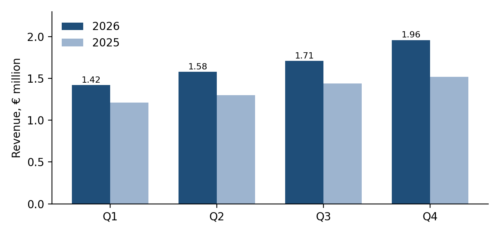
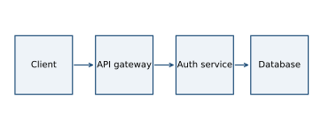

# Text {#sec:text}

Regular text with **bold**, *italic*, ***both***, ~~struck~~, `inline code`,
==highlighted==, H~2~O written as H<sub>2</sub>O, E = mc^2^, <kbd>Ctrl</kbd> +
<kbd>C</kbd>, <u>underlined</u> and a [link](https://example.org). Quotes
"like this" and 'this' follow the document language; dashes -- and --- and
ellipses... become proper punctuation. Latvian: Ģirts ēda ķiļķenus ar šķēpu.
Emoji ✓ ☕ and symbols € § ¶ © ® ™ ±.

A footnote[^first] and an inline one^[Written right here.]. See
@sec:figures for figures and @tbl:spans for a table with merged cells.

[^first]: Footnotes can contain *formatting* and `code`.

> A block quotation set apart from the text, with a second sentence to show
> how lines wrap inside it.

| Line blocks keep
| their line breaks
|     even indentation.

# Lists

1. First item
2. Second item with a nested list
   - bullet one
   - bullet two
     1. deeper numbered
3. Third item

- [x] A finished task
- [ ] An open task

Term
: A definition of the term.

Another term
: Its first definition.
: Its second definition.

# Figures and tables {#sec:figures}

{#fig:revenue}

{#fig:field width=60%}

{#fig:arch width=85%}

@fig:revenue, @fig:field and [-@fig:arch] are numbered automatically.

| Region | Q1 | Q2 | Q3 | Total |
|:-------|---:|---:|---:|------:|
| North  | 1 200 | 1 350 | 1 410 | 3 960 |
| South  | 980 | 1 020 | 1 115 | 3 115 |
| **Sum** | **2 180** | **2 370** | **2 525** | **7 075** |

Table: Quarterly figures, right-aligned automatically. {#tbl:spans}

<table>
<caption>A table with merged cells (from HTML)</caption>
<thead><tr><th rowspan="2">Item</th><th colspan="2">Price</th></tr>
<tr><th>Net</th><th>Gross</th></tr></thead>
<tbody><tr><td>Licence</td><td>9.99</td><td>12.09</td></tr>
<tr><td colspan="2">Support (included)</td><td>0.00</td></tr></tbody>
</table>

# Mathematics

Inline $e^{i\pi} + 1 = 0$, and a numbered display equation:

$$
\int_{-\infty}^{\infty} e^{-x^2}\,dx = \sqrt{\pi}
$$ {#eq:gauss}

@eq:gauss is the Gaussian integral. Matrices and cases work too:

$$
A = \begin{pmatrix} a & b \\ c & d \end{pmatrix}, \qquad
|x| = \begin{cases} x & x \ge 0 \\ -x & x < 0 \end{cases}
$$

# Code

```go {.numberLines}
func main() {
	fmt.Println("Hello, typeset world")
}
```

Listing: A shell session. {#lst:shell}
```sh
crowdoc --style article --colors oxford paper.md
```

# Callouts and theorems

::: note
A note with **formatting**.
:::

::: tip Shortcut
A tip with its own title.
:::

::: warning
Warnings stand out.
:::

> [!IMPORTANT]
> GitHub-style alerts work as well.

::: theorem
Every bounded monotone sequence of real numbers converges.
:::

::: proof
Take the supremum of its terms.
:::

# Citations

Soil holds an enormous diversity of microbes [@fierer2017; @bardgett2014],
and tillage disrupts fungal networks [@six2006, p. 557]. @lal2020 argues for
regenerative practice.

# References
